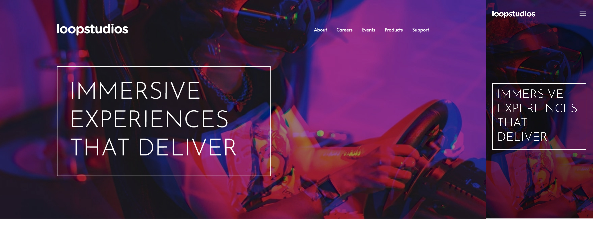

# Frontend Mentor - Loopstudio landing page

This is a solution to the [Loopstudios landing page challenge on Frontend Mentor](https://www.frontendmentor.io/challenges/loopstudios-landing-page-N88J5Onjw). Frontend Mentor challenges help you improve your coding skills by building realistic projects.

## Table of contents

- [Overview](#overview)
  - [The challenge](#the-challenge)
  - [Screenshot](#screenshot)
  - [Links](#links)
- [My process](#my-process)
  - [Built with](#built-with)
  - [What I learned](#what-i-learned)
- [Author](#author)
- [Acknowledgments](#acknowledgments)

## Overview

### The challenge

Users should be able to:

- View the optimal layout for the interface depending on their device's screen size
- See hover and focus states for all interactive elements on the page

### Screenshot



### Links

- Solution URL: [FrontendMentor](https://www.frontendmentor.io/profile/mirfanwebdev)
- Live site URL: [Vercel](https://loopstudio-landing-frontendmentor.vercel.app/)

## My process

### Built with

- Semantic HTML5 markup
- Mobile-first workflow
- Vue js

### What I Learned

This webiste project is built with Vue. For this challenge I tried to explore the concept of Vue using Single File Component (SFC). I also tried to implement binding, lifecycle, and reactivity.

```js
import { reactive } from "vue";

export const store = reactive({
  displayMenu: false,
  toggleMenu() {
    this.displayMenu = !this.displayMenu;
  },
});
```

## Author

- Website - [M. Irfan](https://mirfandev.tech)
- Frontend Mentor - [@mirfanwebdev](https://www.frontendmentor.io/profile/mirfanwebdev)
- Twitter - [@mirfanwebdev](https://https://twitter.com/mirfanwebdev)
